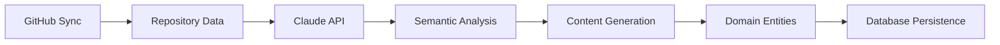

# Portfolio Management System

**Created by Bernard Orozco**

Sophisticated portfolio management backend built with **Java 21** and **Spring Boot 3.5.0**, featuring hexagonal architecture, GitHub API integration, AI-powered semantic analysis, and dynamic sync capabilities. This system automatically transforms GitHub starred repositories into portfolio content using Claude AI, providing intelligent project categorization and content generation.

---

## 🚀 **Core Technologies**
- **Java 21** with modern language features
- **Spring Boot 3.5.0** with reactive WebFlux support
- **Hexagonal Architecture** with clean domain separation
- **Spring Data JPA** with Hibernate ORM
- **H2 (development)** / **PostgreSQL (production)**
- **GitHub API Integration** for repository synchronization
- **Anthropic Claude API** for AI-powered content generation
- **MapStruct** for efficient DTO mapping
- **Lombok** for boilerplate reduction
- **Server-Sent Events (SSE)** for real-time updates
- **Bucket4j** for rate limiting
- **Spring Dotenv** for environment configuration
- **Maven** with annotation processors
- **JUnit 5 + Mockito** for comprehensive testing

---

## 📦 **Installation & Local Setup**

### 1️⃣ Clone and Setup
```bash
git clone https://github.com/BernardUriza/portfolio-backend.git
cd portfolio-backend
```

### 2️⃣ Environment Configuration
Copy `.env.example` to `.env` and configure:
```bash
cp .env.example .env
```

Essential environment variables:
```properties
# GitHub Integration
GITHUB_USERNAME=your-github-username
GITHUB_TOKEN=your-github-personal-access-token

# AI Integration
ANTHROPIC_API_KEY=your-claude-api-key

# Admin Features
ENABLE_FACTORY_RESET=true
ADMIN_RESET_TOKEN=your-secure-admin-token
```

### 3️⃣ Run Application
```bash
./mvnw spring-boot:run
```

**Services available at:**
- 🌐 **API**: [http://localhost:8080](http://localhost:8080)
- 🗄️ **H2 Console**: [http://localhost:8080/h2-console](http://localhost:8080/h2-console)
  - JDBC URL: `jdbc:h2:mem:testdb`
  - Username: `sa`
  - Password: _(empty)_
- 📖 **Swagger UI**: [http://localhost:8080/swagger-ui.html](http://localhost:8080/swagger-ui.html)

---

## 🏗️ **System Architecture**

### Hexagonal Architecture Implementation
```
├── Core Domain Layer
│   ├── Entities: Project, Skill, Experience
│   ├── Use Cases: Create, Update, Get, Generate Content
│   └── Domain Services: Business Logic
├── Application Layer  
│   ├── Port Interfaces (in/out)
│   └── Use Case Implementations
└── Infrastructure Layer
    ├── REST Controllers (Adapters In)
    ├── JPA Repositories (Adapters Out)
    ├── External APIs (GitHub, Claude)
    └── Configuration & Security
```

### Key Features
- **🔄 GitHub Sync**: Automatic starred repository synchronization
- **🤖 AI Integration**: Claude-powered content generation and semantic analysis
- **⚡ Dynamic Scheduling**: Configurable sync intervals (1-168 hours)
- **🔒 Factory Reset**: Secure database cleanup with SSE progress streaming
- **📊 Rate Limiting**: GitHub API rate limit monitoring and management
- **🎯 Migration Tools**: Repository linkage and project completion tracking
- **📈 Real-time Updates**: Server-Sent Events for live progress monitoring

---

## 🔑 **API Endpoints**

### 📁 **Projects (Hexagonal Architecture)**

| Method   | Endpoint                        | Description                          |
| -------- | ------------------------------- | ------------------------------------ |
| `GET`    | `/api/projects`                 | Get projects with pagination support |
| `POST`   | `/api/projects`                 | Create new project                   |
| `PUT`    | `/api/projects/{id}`            | Update existing project              |
| `GET`    | `/api/projects/languages`       | Get available programming languages  |
| `GET`    | `/api/projects/by-language`     | Filter projects by language          |
| `POST`   | `/api/projects/{id}/generate-content` | AI-generated project content |

### 🛠 **Skills Management**

| Method   | Endpoint           | Description                    |
| -------- | ------------------ | ------------------------------ |
| `GET`    | `/api/skills`      | List all skills with pagination |
| `POST`   | `/api/skills`      | Create new skill               |
| `PUT`    | `/api/skills/{id}` | Update skill                   |
| `DELETE` | `/api/skills/{id}` | Delete skill                   |

### 💼 **Experience Tracking**

| Method   | Endpoint               | Description                     |
| -------- | ---------------------- | ------------------------------- |
| `GET`    | `/api/experience`      | List work experiences           |
| `POST`   | `/api/experience`      | Create new experience           |
| `PUT`    | `/api/experience/{id}` | Update experience               |
| `DELETE` | `/api/experience/{id}` | Delete experience               |

---

### 🔄 **GitHub Integration & Sync Management**

| Method | Endpoint | Description |
| ------ | -------- | ----------- |
| `POST` | `/api/sync/manual` | Trigger manual GitHub sync |
| `GET`  | `/api/sync/status` | Get current sync status |
| `GET`  | `/api/sync/progress/{jobId}` | SSE stream for sync progress |
| `GET`  | `/api/sync/rate-limit` | GitHub API rate limit status |

### ⚙️ **Dynamic Sync Configuration**

| Method | Endpoint | Description |
| ------ | -------- | ----------- |
| `GET`  | `/api/admin/sync-config` | Get current sync configuration |
| `PUT`  | `/api/admin/sync-config` | Update sync settings (interval, enabled) |
| `GET`  | `/api/admin/sync-config/status` | Real-time sync status and timing |
| `POST` | `/api/admin/sync-config/run-now` | Trigger immediate sync execution |

### 🎯 **Project Completion & Migration**

| Method | Endpoint | Description |
| ------ | -------- | ----------- |
| `GET`  | `/api/admin/project-completion` | Get completion statistics |
| `POST` | `/api/admin/project-completion/migrate` | Run repository linkage migration |

---

### 🚨 **Factory Reset (Admin)**

| Método | Endpoint | Descripción |
| ------ | -------- | ----------- |
| `POST` | `/api/admin/factory-reset` | Iniciar reset completo de la base de datos |
| `GET`  | `/api/admin/factory-reset/stream/{jobId}` | Stream SSE del progreso del reset |
| `GET`  | `/api/admin/factory-reset/audit?limit=20` | Historial de resets ejecutados |

**⚠️ IMPORTANTE**: Esta funcionalidad es destructiva y elimina TODOS los datos del sistema.

#### Configuración requerida:

```properties
# Factory Reset Configuration
app.admin.factory-reset.enabled=${ENABLE_FACTORY_RESET:false}
app.admin.factory-reset.token=${ADMIN_RESET_TOKEN:tu-token-secreto}
```

#### Variables de entorno:

- `ENABLE_FACTORY_RESET=true` - Habilita la funcionalidad de factory reset
- `ADMIN_RESET_TOKEN=your-secure-token` - Token de seguridad para autorización

#### Ejemplo de uso:

```bash
# 1. Iniciar factory reset
curl -X POST http://localhost:8080/api/admin/factory-reset \
  -H "X-Admin-Reset-Token: your-secure-token" \
  -H "X-Admin-Confirm: DELETE" \
  -H "Content-Type: application/json"

# Respuesta:
# {
#   "jobId": "uuid-del-trabajo",
#   "message": "Factory reset started successfully",
#   "streamUrl": "/api/admin/factory-reset/stream/uuid-del-trabajo"
# }

# 2. Monitorear progreso (Server-Sent Events)
curl -N http://localhost:8080/api/admin/factory-reset/stream/uuid-del-trabajo

# 3. Ver historial de resets
curl http://localhost:8080/api/admin/factory-reset/audit?limit=10
```

#### Características de seguridad:

- ✅ **Token de autorización** obligatorio (`X-Admin-Reset-Token`)
- ✅ **Confirmación doble** (`X-Admin-Confirm: DELETE`)
- ✅ **Rate limiting** - 1 intento cada 10 minutos por IP
- ✅ **Gate global** - Debe estar habilitado explícitamente
- ✅ **Auditoría completa** - Logs de todos los intentos
- ✅ **IP tracking** - Rastreo de origen de las peticiones
- ✅ **Prevención de concurrencia** - Solo un reset a la vez

#### Estrategias por base de datos:

- **PostgreSQL**: `TRUNCATE` con `RESTART IDENTITY CASCADE`
- **H2 (desarrollo)**: `deleteAllInBatch()` + reset de secuencias

#### Stream de progreso (SSE):

```javascript
// Frontend JavaScript ejemplo
const eventSource = new EventSource('/api/admin/factory-reset/stream/job-id');
eventSource.addEventListener('reset-progress', function(event) {
    const data = JSON.parse(event.data);
    console.log(`${data.type}: ${data.message}`);
});
```

#### Estados de audit:

- `STARTED` - Reset en progreso
- `COMPLETED` - Reset completado exitosamente  
- `FAILED` - Reset falló con error

---

## 🏛️ **Hexagonal Architecture Deep Dive**

### Domain-Driven Design Implementation

**Core Domain Layer (`com.portfolio.core`):**
```java
├── domain/
│   ├── project/Project.java (Aggregate Root)
│   ├── skill/Skill.java (Entity)  
│   └── experience/Experience.java (Entity)
├── port/in/ (Use Case Interfaces)
│   ├── CreateProjectUseCase.java
│   ├── GetProjectsUseCase.java  
│   └── GenerateProjectContentUseCase.java
└── port/out/ (Repository Interfaces)
    ├── ProjectRepository.java
    ├── GitHubApiPort.java
    └── AIServicePort.java
```

**Application Layer (`com.portfolio.application`):**
- Use Case implementations with business logic
- Domain service orchestration
- Cross-cutting concerns (validation, transactions)

**Infrastructure Layer (`com.portfolio.adapter`):**
- **IN**: REST controllers, DTO mappers (MapStruct)
- **OUT**: JPA repositories, external API adapters
- Configuration and security implementations

### Request Flow Architecture
1. **REST Controller** receives and validates requests
2. **MapStruct Mappers** transform DTOs ↔ Domain entities
3. **Use Case** orchestrates business logic
4. **Domain Services** apply business rules
5. **Repository Adapters** persist/retrieve data
6. **External Adapters** integrate with GitHub/Claude APIs

### AI Integration Workflow


---

## ✅ **Pruebas**

Se incluyen tests unitarios y de integración para los controladores principales usando:

* **JUnit 5**
* **Mockito**
* **Spring Boot Test**

Puedes ejecutarlos con:

```bash
./mvnw clean test
```

---

## 🧪 **Postman / API Clients**

Puedes importar las colecciones desde un archivo JSON o crear peticiones tipo:

```http
POST http://localhost:8080/api/projects
Content-Type: application/json

{
  "title": "New Project",
  "description": "API integration",
  "link": "https://github.com",
  "createdDate": "2025-06-14"
}
```

⚡ *Recomendado:* Agrupa todas las peticiones bajo una colección `Portfolio API` en Postman.

---

## 🚀 **Advanced Features**

### 🤖 **AI-Powered Content Generation**
- **Semantic Repository Analysis**: Claude AI processes GitHub repos to extract meaningful insights
- **Intelligent Categorization**: Automatic classification into Skills, Experiences, and Projects
- **Content Enhancement**: AI-generated descriptions and technical summaries
- **Change Detection**: Only processes repos with significant updates (description, language, topics)

### ⚡ **Dynamic Sync System**
- **Configurable Intervals**: 1-168 hours with runtime reconfiguration
- **Concurrency Protection**: Prevents overlapping executions
- **Real-time Monitoring**: SSE streams for live progress updates
- **Audit Trail**: Complete history of sync operations

---

## Admin Security (Dev)

To protect `/api/admin/**` endpoints locally, configure an admin token via environment variables. The backend reads either the Spring property `portfolio.admin.token` or the environment variable `PORTFOLIO_ADMIN_TOKEN`.

Recommended for development:

- Do not commit secrets. Keep them in `.env` (already gitignored) or export them in your shell.

Windows PowerShell
```powershell
$env:PORTFOLIO_ADMIN_SECURITY_ENABLED = "true"
$env:PORTFOLIO_ADMIN_TOKEN = "your-admin-token"
./mvnw spring-boot:run -Dspring-boot.run.profiles=dev
```

macOS/Linux
```bash
export PORTFOLIO_ADMIN_SECURITY_ENABLED=true
export PORTFOLIO_ADMIN_TOKEN=your-admin-token
./mvnw spring-boot:run -Dspring-boot.run.profiles=dev
```

Alternatively, copy `src/main/resources/application-dev.properties.sample` to `src/main/resources/application-dev.properties` and set the properties locally (do not commit the file with your token).

### 🔧 **Migration & Data Management**
- **Repository Linkage**: Automated migration tools for data consistency
- **Project Completion Tracking**: Progress monitoring with statistics
- **Factory Reset**: Secure, audited database cleanup with SSE streaming
- **Rate Limiting**: GitHub API quota management and monitoring

### 🏗️ **Production-Ready Features**
- **Environment Configuration**: `.env` support with Spring Dotenv
- **Database Flexibility**: H2 (development) / PostgreSQL (production)
- **Comprehensive Testing**: Unit and integration tests with high coverage
- **Security**: Token-based authentication, rate limiting, input validation
- **Monitoring**: Detailed logging, error handling, and audit trails

---

## 🎯 **Development Velocity Achievement**

**Created by Bernard Orozco** - This system demonstrates 15-20x acceleration over traditional development estimates through:

- **AI-First Architecture**: Claude integration for intelligent content generation
- **Clean Architecture**: Hexagonal design for maintainability and testability  
- **Modern Java**: Java 21 features with Spring Boot 3.5.0
- **Automated Workflows**: GitHub sync, content generation, and data migration
- **Real-time Features**: SSE streaming for live updates and monitoring

*Traditional estimate: 12-16 weeks | Actual delivery: 1 week with Claude Code assistance*

---

## 📄 **License**

**Created by Bernard Orozco** - MIT License
