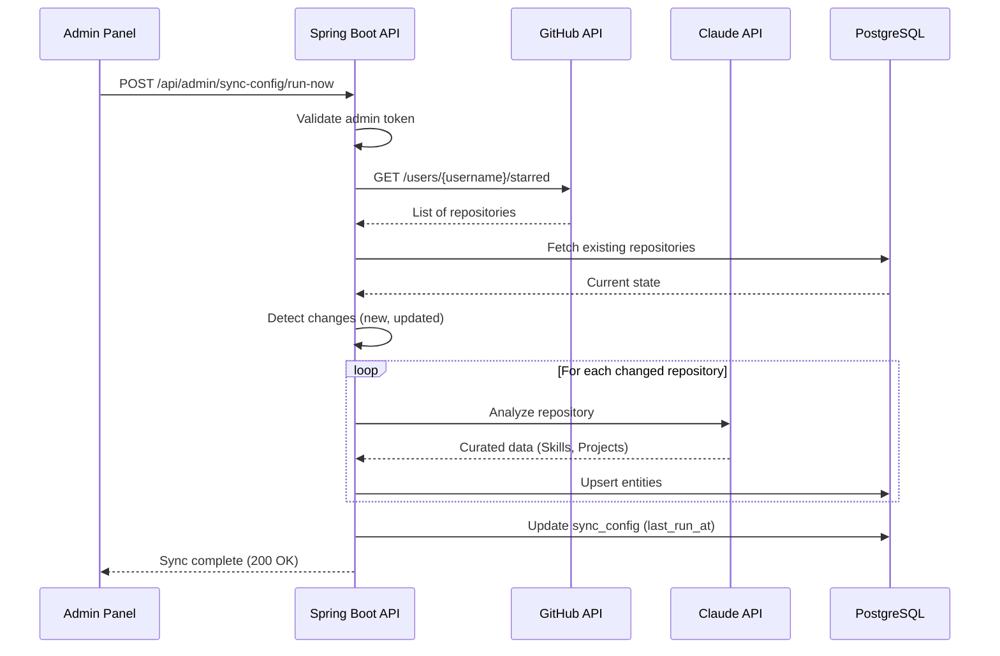
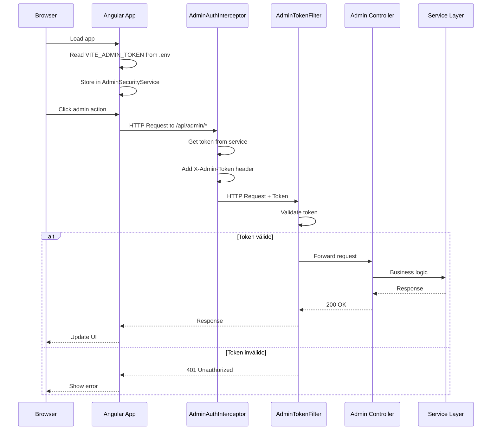
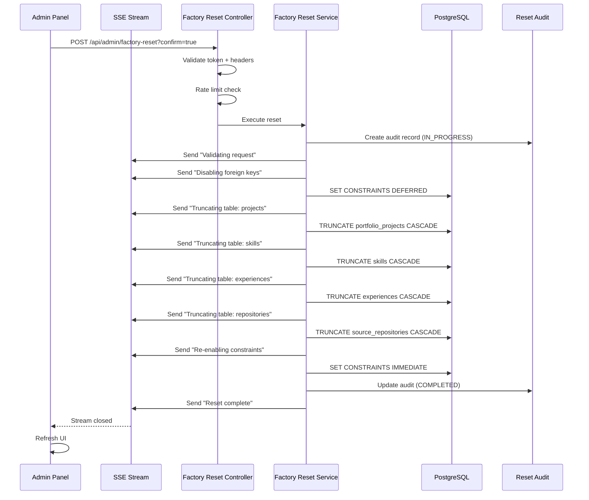

# 🤖 Guía para Agente Codificador Experto - Portfolio Full Stack

## 📋 Índice
1. [Visión General del Proyecto](#visión-general-del-proyecto)
2. [Arquitectura del Sistema](#arquitectura-del-sistema)
3. [Stack Tecnológico](#stack-tecnológico)
4. [Estructura de Directorios](#estructura-de-directorios)
5. [Patrones de Diseño](#patrones-de-diseño)
6. [Requerimientos Funcionales](#requerimientos-funcionales)
7. [Flujos de Trabajo Críticos](#flujos-de-trabajo-críticos)
8. [Convenciones de Código](#convenciones-de-código)
9. [Comandos de Desarrollo](#comandos-de-desarrollo)
10. [Configuración y Variables de Entorno](#configuración-y-variables-de-entorno)
11. [Testing y Quality Assurance](#testing-y-quality-assurance)
12. [Guías de Contribución](#guías-de-contribución)

---

## 🎯 Visión General del Proyecto

### Propósito
Aplicación de portafolio personal full-stack que integra:
- Sincronización automática de repositorios GitHub starred
- Curación de proyectos usando IA (Claude API)
- Panel de administración con autenticación por token
- Sistema de gestión de proyectos, habilidades y experiencias

### Audiencia
- Desarrolladores que quieren mostrar su trabajo
- Reclutadores y empresas buscando talento
- Comunidad técnica interesada en los proyectos

### Objetivos de Negocio
1. Automatizar la actualización del portafolio desde GitHub
2. Usar IA para categorizar y describir proyectos automáticamente
3. Proveer una interfaz administrativa para gestión manual
4. Ofrecer una experiencia de usuario interactiva y moderna

---

## 🏗️ Arquitectura del Sistema

### Arquitectura General

```
┌─────────────────────────────────────────────────────────────┐
│                    FRONTEND (Angular 20)                    │
│  ┌──────────────┐  ┌──────────────┐  ┌──────────────┐     │
│  │   Public     │  │    Admin     │  │   Shared     │     │
│  │   Routes     │  │    Panel     │  │  Components  │     │
│  └──────────────┘  └──────────────┘  └──────────────┘     │
│           │                │                  │             │
│           └────────────────┴──────────────────┘             │
│                            │                                │
│                     HTTP Interceptors                       │
│                    (Admin Auth, CORS)                       │
└────────────────────────────┬───────────────────────────────┘
                             │ REST API
                             │ (Port 4200 → 8080)
┌────────────────────────────▼───────────────────────────────┐
│                   BACKEND (Spring Boot 3.5)                 │
│  ┌──────────────┐  ┌──────────────┐  ┌──────────────┐     │
│  │ Controllers  │  │   Services   │  │  Repositories│     │
│  │   (REST)     │  │  (Business)  │  │     (JPA)    │     │
│  └──────────────┘  └──────────────┘  └──────────────┘     │
│           │                │                  │             │
│  ┌────────┴────────────────┴──────────────────┴────────┐   │
│  │           Security Layer (Token Auth)              │   │
│  └────────────────────────────────────────────────────┘   │
│                                                             │
│  ┌──────────────┐  ┌──────────────┐  ┌──────────────┐     │
│  │   GitHub     │  │   Claude     │  │   Scheduler  │     │
│  │   Client     │  │   Client     │  │   Service    │     │
│  └──────────────┘  └──────────────┘  └──────────────┘     │
└────────────────────────────┬───────────────────────────────┘
                             │
                             │ JPA/Hibernate
                             │
┌────────────────────────────▼───────────────────────────────┐
│               PostgreSQL Database (Port 5432)               │
│  ┌──────────────┐  ┌──────────────┐  ┌──────────────┐     │
│  │  Projects    │  │    Skills    │  │ Experiences  │     │
│  │ Repositories │  │   SyncConfig │  │ ResetAudit   │     │
│  └──────────────┘  └──────────────┘  └──────────────┘     │
└─────────────────────────────────────────────────────────────┘
```

### Arquitectura Hexagonal (Backend)

El backend sigue **Hexagonal Architecture** (Ports & Adapters):

```
src/main/java/com/portfolio/
├── domain/                    # Núcleo del negocio (independiente de frameworks)
│   ├── model/                # Entidades de dominio
│   ├── port/                 # Interfaces (puertos)
│   │   ├── in/              # Casos de uso (entrada)
│   │   └── out/             # Adaptadores externos (salida)
│   └── service/             # Lógica de negocio pura
│
├── adapter/                  # Implementaciones de puertos
│   ├── in/                  # Controladores REST, eventos
│   │   └── web/
│   │       └── controller/
│   └── out/                 # Persistencia, APIs externas
│       ├── persistence/     # JPA, repositorios
│       └── external/        # GitHub, Claude API
│
├── config/                   # Configuración de Spring
├── security/                 # Filtros de seguridad
└── dto/                      # Objetos de transferencia de datos
```

**Ventajas**:
- ✅ Lógica de negocio independiente de frameworks
- ✅ Fácil testing (mock de puertos)
- ✅ Cambio de tecnologías sin afectar el dominio
- ✅ Separación clara de responsabilidades

---

## 💻 Stack Tecnológico

### Frontend
| Tecnología | Versión | Propósito |
|------------|---------|-----------|
| **Angular** | 20.x | Framework principal |
| **TypeScript** | 5.x | Lenguaje |
| **RxJS** | 7.x | Programación reactiva |
| **TailwindCSS** | 3.x | Estilos |
| **Vite** | 6.x | Build tool y dev server |
| **Standalone Components** | - | Arquitectura sin NgModules |
| **Signals** | - | Estado reactivo |

### Backend
| Tecnología | Versión | Propósito |
|------------|---------|-----------|
| **Spring Boot** | 3.5.0 | Framework principal |
| **Java** | 25 | Lenguaje |
| **Spring Data JPA** | 3.x | Persistencia |
| **Hibernate** | 6.6.15 | ORM |
| **PostgreSQL** | 14.x | Base de datos producción |
| **H2** | - | Base de datos testing |
| **Spring Security** | 6.x | Autenticación/Autorización |
| **Caffeine** | - | Cache en memoria |
| **Resilience4j** | - | Circuit breakers, retry |

### Integraciones Externas
| Servicio | API | Propósito |
|----------|-----|-----------|
| **GitHub** | REST API v3 | Sincronización de repositorios starred |
| **Anthropic Claude** | Claude 3.5 Sonnet | Curación de proyectos con IA |

### Herramientas de Desarrollo
- **Maven** 3.9.10 - Build backend
- **npm** - Package manager frontend
- **VS Code** - IDE principal
- **Git** - Control de versiones
- **REST Client** - Testing de APIs

---

## 📁 Estructura de Directorios

### Backend (`portfolio-spring/`)

```
portfolio-spring/
├── src/main/java/com/portfolio/
│   ├── adapter/
│   │   ├── in/web/controller/          # REST Controllers
│   │   │   ├── AdminResetController.java
│   │   │   ├── HealthController.java
│   │   │   ├── PublicPortfolioController.java
│   │   │   ├── SecurityAdminController.java
│   │   │   ├── SyncConfigAdminController.java
│   │   │   └── SyncMonitorAdminController.java
│   │   └── out/
│   │       ├── persistence/            # JPA Entities & Repositories
│   │       │   ├── entity/
│   │       │   └── repository/
│   │       └── external/               # External API Clients
│   │           ├── github/
│   │           └── ai/
│   ├── domain/
│   │   ├── model/                      # Domain Models
│   │   │   ├── PortfolioProject.java
│   │   │   ├── SourceRepository.java
│   │   │   ├── Skill.java
│   │   │   ├── Experience.java
│   │   │   ├── SyncConfig.java
│   │   │   └── ResetAudit.java
│   │   ├── port/
│   │   │   ├── in/                     # Use Cases (interfaces)
│   │   │   └── out/                    # External ports
│   │   └── service/                    # Domain Services
│   ├── config/                         # Spring Configuration
│   │   ├── SecurityConfig.java
│   │   ├── CorsConfig.java
│   │   ├── CacheConfig.java
│   │   ├── RestTemplateConfig.java
│   │   └── SyncConfigInitializer.java
│   ├── security/                       # Security Filters
│   │   ├── AdminTokenAuthenticationFilter.java
│   │   └── NoSecurityConfig.java
│   ├── dto/                            # Data Transfer Objects
│   └── service/                        # Application Services
│       ├── GitHubSyncService.java
│       ├── SyncSchedulerService.java
│       ├── ClaudeService.java
│       ├── FactoryResetService.java
│       └── StartupNotificationService.java
├── src/main/resources/
│   ├── application.properties          # Configuración principal
│   ├── application-dev.properties      # Perfil desarrollo
│   ├── application-prod.properties     # Perfil producción
│   └── schema.sql                      # DDL inicial (opcional)
├── src/test/java/                      # Tests unitarios e integración
├── .env                                # Variables de entorno (NO COMMITEAR)
├── pom.xml                             # Maven dependencies
├── README_START.md                     # Guía de inicio rápido
├── CLAUDE.md                           # Documentación para Claude
└── DEV_SCRIPTS.md                      # Documentación de scripts
```

### Frontend (`portfolio-frontend/`)

```
portfolio-frontend/
├── src/
│   ├── app/
│   │   ├── core/                       # Servicios singleton, interceptores
│   │   │   ├── interceptors/
│   │   │   │   └── admin-auth.interceptor.ts
│   │   │   └── services/
│   │   │       ├── bootstrap.service.ts
│   │   │       └── server-status.service.ts
│   │   ├── features/                   # Módulos funcionales
│   │   │   ├── admin/                  # Panel de administración
│   │   │   │   ├── admin.component.ts
│   │   │   │   ├── components/
│   │   │   │   │   ├── admin-security/
│   │   │   │   │   └── sync-config/
│   │   │   │   ├── factory-reset/
│   │   │   │   └── services/
│   │   │   │       └── admin-security.service.ts
│   │   │   ├── home/
│   │   │   ├── projects/
│   │   │   ├── skills/
│   │   │   └── experience/
│   │   ├── shared/                     # Componentes compartidos
│   │   │   ├── components/
│   │   │   ├── directives/
│   │   │   └── pipes/
│   │   └── app.component.ts            # Componente raíz
│   ├── environments/                   # Configuración por ambiente
│   │   ├── environment.ts              # Desarrollo
│   │   └── environment.prod.ts         # Producción
│   ├── assets/                         # Recursos estáticos
│   ├── styles.css                      # Estilos globales
│   └── main.ts                         # Bootstrap de la app
├── .env                                # Variables de entorno (NO COMMITEAR)
├── angular.json                        # Configuración Angular CLI
├── tsconfig.json                       # TypeScript config
├── tailwind.config.js                  # TailwindCSS config
├── vite.config.ts                      # Vite config
└── package.json                        # Dependencies npm
```

---

## 🎨 Patrones de Diseño

### Backend

#### 1. **Hexagonal Architecture (Ports & Adapters)**
```java
// Puerto de entrada (caso de uso)
public interface SyncRepositoriesUseCase {
    void syncStarredRepositories();
}

// Adaptador de entrada (REST)
@RestController
public class SyncController {
    private final SyncRepositoriesUseCase syncUseCase;
    // ...
}

// Puerto de salida (interfaz externa)
public interface GitHubPort {
    List<Repository> fetchStarredRepos(String username);
}

// Adaptador de salida (implementación)
public class GitHubAdapter implements GitHubPort {
    // Llamadas a GitHub API
}
```

#### 2. **Repository Pattern**
```java
public interface PortfolioProjectRepository extends JpaRepository<PortfolioProjectJpaEntity, Long> {
    List<PortfolioProjectJpaEntity> findByVisibleTrue();
    Optional<PortfolioProjectJpaEntity> findByGithubId(Long githubId);
}
```

#### 3. **Service Layer Pattern**
```java
@Service
public class GitHubSyncService {
    private final GitHubPort githubPort;
    private final PortfolioProjectRepository projectRepo;

    @Transactional
    public void syncRepositories() {
        // Lógica de sincronización
    }
}
```

#### 4. **DTO Pattern**
```java
public record PortfolioProjectDTO(
    Long id,
    String title,
    String description,
    List<String> technologies
) {}
```

#### 5. **Strategy Pattern** (Factory Reset)
```java
public interface ResetStrategy {
    void resetDatabase();
}

@Component
public class PostgresResetStrategy implements ResetStrategy {
    // Implementación para PostgreSQL
}

@Component
public class H2ResetStrategy implements ResetStrategy {
    // Implementación para H2
}
```

#### 6. **Builder Pattern** (Entidades complejas)
```java
PortfolioProject project = PortfolioProject.builder()
    .title("Project Title")
    .description("Description")
    .technologies(List.of("Java", "Spring"))
    .build();
```

#### 7. **Singleton Pattern** (Servicios Spring)
Todos los `@Service`, `@Component`, `@Controller` son singletons por defecto.

#### 8. **Template Method Pattern** (Scheduled Tasks)
```java
@Scheduled(fixedRate = 3600000) // Template definido por Spring
public void scheduledSync() {
    // Implementación específica
}
```

### Frontend

#### 1. **Standalone Components** (Angular 20)
```typescript
@Component({
  selector: 'app-admin',
  standalone: true,
  imports: [CommonModule, RouterModule],
  templateUrl: './admin.component.html'
})
export class AdminComponent {}
```

#### 2. **Service Pattern** (Inyección de dependencias)
```typescript
@Injectable({ providedIn: 'root' })
export class AdminSecurityService {
  // Singleton service
}
```

#### 3. **Observer Pattern** (RxJS)
```typescript
this.adminToken$.pipe(
  filter(token => !!token),
  switchMap(token => this.getSecurityStatus())
).subscribe();
```

#### 4. **Interceptor Pattern**
```typescript
export const adminAuthInterceptor: HttpInterceptorFn = (req, next) => {
  if (req.url.startsWith('/api/admin/')) {
    const token = inject(AdminSecurityService).getAdminToken();
    req = req.clone({
      headers: req.headers.set('X-Admin-Token', token)
    });
  }
  return next(req);
};
```

#### 5. **Facade Pattern** (AdminSecurityService)
Encapsula múltiples operaciones de seguridad en una interfaz simple.

#### 6. **Strategy Pattern** (Environment configs)
```typescript
// environment.ts (desarrollo)
export const environment = {
  production: false,
  apiRoot: 'http://localhost:8080/api'
};

// environment.prod.ts (producción)
export const environment = {
  production: true,
  apiRoot: 'https://api.production.com/api'
};
```

---

## ⚙️ Requerimientos Funcionales

### RF-001: Sincronización de Repositorios GitHub
**Descripción**: El sistema debe sincronizar automáticamente los repositorios starred del usuario desde GitHub.

**Criterios de Aceptación**:
- [ ] Sincronización manual mediante endpoint `/api/admin/sync-config/run-now`
- [ ] Sincronización automática configurable (1-168 horas)
- [ ] Detección de cambios (nuevos repos, actualizaciones de descripción/topics)
- [ ] Manejo de rate limiting de GitHub API
- [ ] Retry con backoff exponencial en caso de fallo
- [ ] Logging detallado de cada sincronización

**Endpoints**:
- `POST /api/admin/sync-config/run-now` - Trigger manual
- `GET /api/admin/sync-config/status` - Estado de última sync
- `PUT /api/admin/sync-config` - Configurar intervalo

**Entidades Afectadas**:
- `SourceRepositoryJpaEntity`
- `SyncConfigJpaEntity`

### RF-002: Curación con IA (Claude)
**Descripción**: Transformar repositorios GitHub en Skills, Experiences y Projects usando análisis semántico de Claude.

**Criterios de Aceptación**:
- [ ] Análisis de descripción, lenguajes y topics del repositorio
- [ ] Generación de títulos y descripciones mejoradas
- [ ] Categorización automática (Skill, Experience, Project)
- [ ] Respeto de campos protegidos (manualmente editados)
- [ ] Presupuesto de tokens configurable
- [ ] Logging de uso de tokens

**Configuración**:
```properties
ANTHROPIC_API_KEY=your-api-key
ENABLE_AI_FEATURES=true
CLAUDE_DAILY_TOKEN_BUDGET=100000
```

**Entidades Afectadas**:
- `SkillJpaEntity`
- `ExperienceJpaEntity`
- `PortfolioProjectJpaEntity`

### RF-003: Panel de Administración
**Descripción**: Interfaz web para gestionar proyectos, sincronización y configuración.

**Criterios de Aceptación**:
- [ ] Autenticación por token (X-Admin-Token header)
- [ ] Auto-carga de token desde `.env` en desarrollo
- [ ] Vista de proyectos, skills y experiencias
- [ ] Edición manual de campos
- [ ] Control de visibilidad (show/hide projects)
- [ ] Configuración de auto-sync
- [ ] Factory reset con confirmación

**Rutas**:
- `/admin` - Panel principal
- `/admin/projects` - Gestión de proyectos
- `/admin/sync` - Configuración de sincronización
- `/admin/security` - Estado de seguridad

**Seguridad**:
- Token requerido para todos los endpoints `/api/admin/*`
- CORS configurado para `localhost:4200`
- Rate limiting: 60 req/min por IP

### RF-004: Factory Reset
**Descripción**: Resetear la base de datos a estado inicial sin perder configuración.

**Criterios de Aceptación**:
- [ ] Confirmación doble (header + query param)
- [ ] Limpieza de todas las tablas excepto `sync_config`
- [ ] SSE (Server-Sent Events) para progreso en tiempo real
- [ ] Auditoría completa en tabla `reset_audit`
- [ ] Rate limiting: 1 reset por 10 minutos por IP
- [ ] Soporte para PostgreSQL y H2

**Endpoint**:
```http
POST /api/admin/factory-reset?confirm=true
X-Confirm-Reset: true
X-Admin-Token: your-token
```

**Response Stream (SSE)**:
```
data: {"step": "Validating request", "status": "in_progress"}
data: {"step": "Truncating tables", "status": "in_progress"}
data: {"step": "Reset complete", "status": "completed"}
```

### RF-005: Health Check y Monitoring
**Descripción**: Endpoints de salud para monitoreo de producción.

**Criterios de Aceptación**:
- [ ] `/api/health` - Health check público
- [ ] `/actuator/health` - Spring Boot actuator
- [ ] `/actuator/health/liveness` - Kubernetes liveness
- [ ] `/actuator/health/readiness` - Kubernetes readiness
- [ ] Tiempos de respuesta < 100ms
- [ ] Verificación de conexión a base de datos

### RF-006: Gestión de Estado (Frontend)
**Descripción**: Manejo de estado reactivo usando Signals y RxJS.

**Criterios de Aceptación**:
- [ ] Signals para estado local de componentes
- [ ] BehaviorSubjects para estado compartido entre servicios
- [ ] Unsubscribe automático con `takeUntilDestroyed()`
- [ ] Error handling con `catchError` en todos los observables
- [ ] Loading states para UX

**Ejemplo**:
```typescript
export class AdminSecurityService {
  private adminTokenSubject = new BehaviorSubject<string | null>(null);
  readonly adminToken$ = this.adminTokenSubject.asObservable();

  setAdminToken(token: string): void {
    this.adminTokenSubject.next(token);
    localStorage.setItem('admin_token', token);
  }
}
```

---

## 🔄 Flujos de Trabajo Críticos

### Flujo 1: Sincronización de Repositorios



**Código Relevante**:
- `GitHubSyncService.java:syncStarredRepositories()`
- `ClaudeService.java:curateRepository()`
- `SyncSchedulerService.java:triggerManualSync()`

### Flujo 2: Autenticación Admin



**Código Relevante**:
- Frontend: `admin-auth.interceptor.ts`
- Frontend: `admin-security.service.ts`
- Backend: `AdminTokenAuthenticationFilter.java`
- Backend: `SecurityConfig.java`

### Flujo 3: Factory Reset



**Código Relevante**:
- `AdminResetController.java`
- `FactoryResetService.java`
- `ResetAudit.java` (domain model)

---

## 📝 Convenciones de Código

### Backend (Java)

#### Nombres de Clases
```java
// Controllers: sustantivo + Controller
public class AdminResetController {}
public class PublicPortfolioController {}

// Services: sustantivo + Service
public class GitHubSyncService {}
public class ClaudeService {}

// Entities (JPA): sustantivo + JpaEntity
public class PortfolioProjectJpaEntity {}
public class SourceRepositoryJpaEntity {}

// DTOs: sustantivo + DTO
public record PortfolioProjectDTO() {}

// Domain Models: sustantivo simple
public class PortfolioProject {}
```

#### Métodos
```java
// Use cases (verbos en infinitivo)
void syncStarredRepositories();
List<Project> findVisibleProjects();

// Queries (prefijos: find, get, fetch)
Optional<Project> findById(Long id);
List<Project> findByVisibleTrue();

// Commands (verbos imperativos)
void createProject(ProjectDTO dto);
void updateProject(Long id, ProjectDTO dto);
void deleteProject(Long id);

// Predicados (is, has, can)
boolean isTokenValid(String token);
boolean hasPermission(User user);
```

#### Logging
```java
@Slf4j
public class MyService {
    public void doSomething() {
        log.info("Starting operation: {}", operationName);
        log.debug("Details: key={}, value={}", key, value);
        log.warn("Warning: rate limit approaching");
        log.error("Error occurred", exception);
    }
}
```

#### Transacciones
```java
@Transactional(readOnly = true)  // Para lecturas
public List<Project> findAll() {}

@Transactional  // Para escrituras
public void syncRepositories() {}
```

### Frontend (TypeScript/Angular)

#### Componentes
```typescript
// Standalone components (Angular 20)
@Component({
  selector: 'app-admin-panel',
  standalone: true,
  imports: [CommonModule, ReactiveFormsModule],
  templateUrl: './admin-panel.component.html',
  styleUrls: ['./admin-panel.component.css']
})
export class AdminPanelComponent implements OnInit, OnDestroy {
  private destroyRef = inject(DestroyRef);

  ngOnInit(): void {
    this.loadData();
  }
}
```

#### Servicios
```typescript
@Injectable({ providedIn: 'root' })
export class AdminSecurityService {
  private http = inject(HttpClient);
  private adminTokenSubject = new BehaviorSubject<string | null>(null);

  readonly adminToken$ = this.adminTokenSubject.asObservable();

  setAdminToken(token: string): void {
    this.adminTokenSubject.next(token);
  }
}
```

#### Observables
```typescript
// Siempre usar takeUntilDestroyed para cleanup
this.dataService.getData().pipe(
  takeUntilDestroyed(this.destroyRef),
  catchError(err => {
    console.error('Error:', err);
    return of(null);
  })
).subscribe(data => {
  this.data = data;
});
```

#### Signals (Angular 20)
```typescript
export class MyComponent {
  // Writable signal
  count = signal(0);

  // Computed signal
  doubleCount = computed(() => this.count() * 2);

  increment(): void {
    this.count.update(v => v + 1);
  }
}
```

### Estilos (TailwindCSS)

```html
<!-- Usar clases de utilidad de Tailwind -->
<div class="flex items-center justify-between p-4 bg-gray-100 rounded-lg shadow-md">
  <h2 class="text-2xl font-bold text-gray-800">Title</h2>
  <button class="px-4 py-2 bg-blue-500 text-white rounded hover:bg-blue-600 transition">
    Action
  </button>
</div>
```

### Comentarios

```java
/**
 * Sincroniza repositorios starred desde GitHub y los procesa con IA.
 *
 * <p>Este método realiza las siguientes operaciones:
 * <ol>
 *   <li>Obtiene repos starred desde GitHub API</li>
 *   <li>Detecta cambios comparando con DB</li>
 *   <li>Envía repos cambiados a Claude para curación</li>
 *   <li>Actualiza entidades en base de datos</li>
 * </ol>
 *
 * @throws GitHubApiException si la API de GitHub falla
 * @throws ClaudeApiException si la API de Claude falla
 * @see GitHubPort
 * @see ClaudeService
 */
@Transactional
public void syncStarredRepositories() {
    // Implementación
}
```

---

## 🚀 Comandos de Desarrollo

### Inicio Rápido

```bash
# Opción 1: Script todo-en-uno (RECOMENDADO)
./dev.sh

# Opción 2: Solo backend
./dev.sh --backend-only

# Opción 3: Solo frontend
./dev.sh --frontend-only

# Detener todos los servicios
./stop.sh

# Limpiar puertos colgados
./dev.sh --clean
```

### Backend (Manual)

```bash
# Compilar
./mvnw clean compile

# Ejecutar
./mvnw spring-boot:run

# Ejecutar con perfil específico
./mvnw spring-boot:run -Dspring-boot.run.profiles=dev

# Tests
./mvnw test

# Package JAR
./mvnw clean package

# Skip tests
./mvnw clean package -DskipTests

# Clean install
./mvnw clean install
```

### Frontend (Manual)

```bash
# Instalar dependencias
npm install

# Dev server
npm start
# o
ng serve

# Build desarrollo
ng build

# Build producción
ng build --configuration production

# Tests
ng test

# E2E tests
ng e2e

# Lint
ng lint
```

### Base de Datos

```bash
# Iniciar PostgreSQL (macOS con Homebrew)
brew services start postgresql@14

# Verificar si está corriendo
pg_isready

# Crear base de datos
createdb portfolio_db

# Conectar con psql
psql -d portfolio_db

# Ver tablas
\dt

# Describir tabla
\d portfolio_projects

# Salir
\q
```

### Git

```bash
# Status
git status

# Add cambios
git add .

# Commit
git commit -m "feat: Add admin token auto-detection"

# Push
git push origin main

# Crear branch
git checkout -b feature/nueva-funcionalidad

# Ver logs
git log --oneline --graph
```

---

## 🔧 Configuración y Variables de Entorno

### Backend (`.env`)

```bash
# ==========================================
# 🔐 Admin & Security Configuration
# ==========================================
PORTFOLIO_ADMIN_TOKEN=dev-admin-token-12345-change-in-production
PORTFOLIO_ADMIN_SECURITY_ENABLED=true

# ==========================================
# 🐙 GitHub Configuration
# ==========================================
GITHUB_USERNAME=BernardUriza
GITHUB_TOKEN=ghp_your_github_token_here

# ==========================================
# 🤖 Anthropic Claude API Configuration
# ==========================================
ANTHROPIC_API_KEY=sk-ant-your-api-key-here

# ==========================================
# 🔄 Feature Flags
# ==========================================
ENABLE_AI_FEATURES=false
ENABLE_LIVE_NARRATION=false
ENABLE_FACTORY_RESET=true
ADMIN_RESET_TOKEN=your-secure-reset-token

# ==========================================
# 🚀 Auto Sync Configuration
# ==========================================
FEATURE_AUTO_SYNC_ENABLED=true
FEATURE_MANUAL_SYNC_ENABLED=true
FEATURE_SCHEDULED_SYNC_ENABLED=true

# ==========================================
# 🎯 AI Curation Configuration
# ==========================================
FEATURE_AI_CURATION_ENABLED=false
FEATURE_MANUAL_CURATION_ENABLED=true

# ==========================================
# 📊 Claude Token Budget
# ==========================================
CLAUDE_DAILY_TOKEN_BUDGET=100000
CLAUDE_WARN_THRESHOLD=0.8

# ==========================================
# ⚙️ Resilience Configuration
# ==========================================
GITHUB_RETRY_MAX_ATTEMPTS=3
GITHUB_RETRY_WAIT_DURATION=500ms
CLAUDE_RETRY_MAX_ATTEMPTS=3
CLAUDE_RETRY_WAIT_DURATION=1s
```

### Frontend (`.env`)

```bash
# ==========================================
# 🔐 Admin Token Configuration
# ==========================================
VITE_ADMIN_TOKEN=dev-admin-token-12345-change-in-production

# ==========================================
# 🌐 API Configuration
# ==========================================
VITE_API_URL=http://localhost:8080

# ==========================================
# 🎯 Feature Flags
# ==========================================
VITE_ENABLE_AI_FEATURES=false
VITE_ENABLE_ADMIN_PANEL=true
```

### `application.properties`

```properties
# ==========================================
# Server Configuration
# ==========================================
server.port=8080

# ==========================================
# Database Configuration (PostgreSQL)
# ==========================================
spring.datasource.url=jdbc:postgresql://localhost:5432/portfolio_db
spring.datasource.username=postgres
spring.datasource.password=ADMIN
spring.datasource.driver-class-name=org.postgresql.Driver

# ==========================================
# JPA Configuration
# ==========================================
spring.jpa.hibernate.ddl-auto=update
spring.jpa.show-sql=false
spring.jpa.properties.hibernate.format_sql=true
spring.jpa.properties.hibernate.dialect=org.hibernate.dialect.PostgreSQLDialect

# ==========================================
# Logging
# ==========================================
logging.level.root=INFO
logging.level.com.portfolio=DEBUG
logging.level.org.springframework.web=DEBUG

# ==========================================
# Admin Token
# ==========================================
portfolio.admin.token=${PORTFOLIO_ADMIN_TOKEN:}
portfolio.admin.security.enabled=${PORTFOLIO_ADMIN_SECURITY_ENABLED:true}

# ==========================================
# GitHub Configuration
# ==========================================
github.username=${GITHUB_USERNAME:}
github.token=${GITHUB_TOKEN:}

# ==========================================
# Claude API
# ==========================================
anthropic.api.key=${ANTHROPIC_API_KEY:}
```

---

## 🧪 Testing y Quality Assurance

### Backend Testing

#### Tests Unitarios (JUnit 5 + Mockito)

```java
@ExtendWith(MockitoExtension.class)
class GitHubSyncServiceTest {

    @Mock
    private GitHubPort githubPort;

    @Mock
    private PortfolioProjectRepository projectRepo;

    @InjectMocks
    private GitHubSyncService syncService;

    @Test
    void shouldSyncNewRepository() {
        // Given
        Repository githubRepo = new Repository(1L, "test-repo", "Description");
        when(githubPort.fetchStarredRepos("user")).thenReturn(List.of(githubRepo));
        when(projectRepo.findByGithubId(1L)).thenReturn(Optional.empty());

        // When
        syncService.syncStarredRepositories();

        // Then
        verify(projectRepo).save(any(PortfolioProjectJpaEntity.class));
    }
}
```

#### Tests de Integración (Spring Boot Test)

```java
@SpringBootTest
@AutoConfigureMockMvc
class AdminResetControllerIntegrationTest {

    @Autowired
    private MockMvc mockMvc;

    @Test
    void shouldResetDatabaseWithValidToken() throws Exception {
        mockMvc.perform(post("/api/admin/factory-reset")
                .param("confirm", "true")
                .header("X-Admin-Token", "valid-token")
                .header("X-Confirm-Reset", "true"))
            .andExpect(status().isOk());
    }
}
```

### Frontend Testing

#### Tests de Componentes (Jasmine + Karma)

```typescript
describe('AdminSecurityComponent', () => {
  let component: AdminSecurityComponent;
  let fixture: ComponentFixture<AdminSecurityComponent>;
  let securityService: jasmine.SpyObj<AdminSecurityService>;

  beforeEach(() => {
    const spy = jasmine.createSpyObj('AdminSecurityService', ['getSecurityStatus']);

    TestBed.configureTestingModule({
      imports: [AdminSecurityComponent],
      providers: [
        { provide: AdminSecurityService, useValue: spy }
      ]
    });

    fixture = TestBed.createComponent(AdminSecurityComponent);
    component = fixture.componentInstance;
    securityService = TestBed.inject(AdminSecurityService) as jasmine.SpyObj<AdminSecurityService>;
  });

  it('should load security status on init', () => {
    const mockStatus = { security: { enabled: true } };
    securityService.getSecurityStatus.and.returnValue(of(mockStatus));

    component.ngOnInit();

    expect(securityService.getSecurityStatus).toHaveBeenCalled();
  });
});
```

### API Testing (REST Client)

Crear archivo `api-tests.http`:

```http
### Health Check
GET http://localhost:8080/api/health

### Get Security Status (Admin)
GET http://localhost:8080/api/admin/security/status
X-Admin-Token: dev-admin-token-12345-change-in-production

### Trigger Manual Sync
POST http://localhost:8080/api/admin/sync-config/run-now
X-Admin-Token: dev-admin-token-12345-change-in-production

### Factory Reset (DANGEROUS)
POST http://localhost:8080/api/admin/factory-reset?confirm=true
X-Admin-Token: dev-admin-token-12345-change-in-production
X-Confirm-Reset: true
```

### Estrategia de Testing

| Tipo | Cobertura Target | Herramientas |
|------|------------------|--------------|
| **Unit Tests** | > 80% | JUnit 5, Mockito, Jasmine |
| **Integration Tests** | > 60% | Spring Boot Test, TestBed |
| **E2E Tests** | Critical paths | Cypress |
| **API Tests** | 100% endpoints | REST Client, Postman |

---

## 📚 Guías de Contribución

### Workflow de Desarrollo

1. **Crear branch desde `main`**:
   ```bash
   git checkout -b feature/nueva-funcionalidad
   ```

2. **Desarrollar con commits frecuentes**:
   ```bash
   git add .
   git commit -m "feat: Add new feature"
   ```

3. **Ejecutar tests localmente**:
   ```bash
   ./mvnw test  # Backend
   ng test      # Frontend
   ```

4. **Push a remoto**:
   ```bash
   git push origin feature/nueva-funcionalidad
   ```

5. **Crear Pull Request**

### Convenciones de Commits (Conventional Commits)

```
<type>(<scope>): <subject>

<body>

<footer>
```

**Tipos**:
- `feat`: Nueva funcionalidad
- `fix`: Corrección de bug
- `docs`: Cambios en documentación
- `style`: Formateo, sin cambios de código
- `refactor`: Refactorización de código
- `test`: Agregar o modificar tests
- `chore`: Tareas de mantenimiento

**Ejemplos**:
```bash
feat(admin): Add factory reset endpoint with SSE progress
fix(sync): Handle rate limiting from GitHub API
docs(readme): Update installation instructions
refactor(service): Extract GitHub client to separate class
test(controller): Add integration tests for admin endpoints
```

### Code Review Checklist

**Backend**:
- [ ] Tests unitarios cubren casos edge
- [ ] Logging apropiado en métodos críticos
- [ ] Manejo de excepciones con try-catch
- [ ] Transacciones `@Transactional` donde sea necesario
- [ ] Validación de inputs con `@Valid`
- [ ] Documentación JavaDoc en métodos públicos

**Frontend**:
- [ ] Componentes standalone (Angular 20)
- [ ] Unsubscribe de observables con `takeUntilDestroyed()`
- [ ] Error handling con `catchError`
- [ ] Loading states para UX
- [ ] Accesibilidad (aria-labels, keyboard navigation)
- [ ] Responsive design (mobile-first)

### Debugging Tips

**Backend**:
```java
// Logs detallados
log.debug("Syncing repository: id={}, name={}", repo.getId(), repo.getName());

// Breakpoints en IntelliJ/VS Code
// Set breakpoint → Run in Debug mode → Inspect variables

// Ver SQL queries
spring.jpa.show-sql=true
spring.jpa.properties.hibernate.format_sql=true
```

**Frontend**:
```typescript
// Console logs
console.log('Component initialized', this.data);
console.table(this.projects);

// Chrome DevTools → Sources → Set breakpoints
// RxJS debugging
import { tap } from 'rxjs';

this.data$.pipe(
  tap(data => console.log('Data received:', data))
).subscribe();
```

### Performance Considerations

**Backend**:
- Usar `@Cacheable` para datos que no cambian frecuentemente
- Lazy loading de relaciones JPA
- Pagination en queries grandes (`Pageable`)
- Connection pooling (HikariCP) configurado
- Índices en columnas frecuentemente buscadas

**Frontend**:
- Lazy loading de rutas (`loadComponent`)
- OnPush change detection donde sea posible
- TrackBy en `*ngFor`
- Virtual scrolling para listas largas
- Image optimization (lazy loading, WebP)

---

## 🎓 Recursos de Aprendizaje

### Documentación Oficial
- [Spring Boot 3.5 Docs](https://docs.spring.io/spring-boot/index.html)
- [Angular 20 Docs](https://angular.dev)
- [PostgreSQL 14 Docs](https://www.postgresql.org/docs/14/)
- [GitHub REST API](https://docs.github.com/en/rest)
- [Anthropic Claude API](https://docs.anthropic.com/claude/reference)

### Arquitectura
- [Hexagonal Architecture (Ports & Adapters)](https://alistair.cockburn.us/hexagonal-architecture/)
- [Domain-Driven Design](https://martinfowler.com/bliki/DomainDrivenDesign.html)

### Best Practices
- [12 Factor App](https://12factor.net/)
- [RESTful API Design](https://restfulapi.net/)
- [Angular Style Guide](https://angular.dev/style-guide)

---

## 🔐 Seguridad

### Principios de Seguridad Implementados

1. **Authentication**: Token-based (X-Admin-Token header)
2. **Authorization**: Role-based access control (ROLE_ADMIN)
3. **CORS**: Configurado explícitamente para localhost:4200
4. **Rate Limiting**: 60 req/min para admin endpoints
5. **Input Validation**: Bean Validation (`@Valid`, `@NotNull`)
6. **SQL Injection**: Protegido por JPA/Hibernate
7. **XSS**: Angular sanitiza templates automáticamente
8. **HTTPS**: Requerido en producción

### Checklist de Seguridad para Producción

- [ ] Cambiar todos los tokens y secrets
- [ ] Habilitar HTTPS
- [ ] Configurar CORS para dominio de producción
- [ ] Aumentar rate limiting
- [ ] Habilitar logging de auditoría
- [ ] Configurar Spring Security completo (no solo token)
- [ ] Habilitar CSRF protection
- [ ] Usar variables de entorno (nunca hardcodear secrets)
- [ ] Configurar firewall de base de datos
- [ ] Habilitar backups automáticos

---

## 📞 Contacto y Soporte

**Desarrollador Principal**: Bernard Uriza
**GitHub**: [BernardUriza](https://github.com/BernardUriza)
**Documentación**: Ver `CLAUDE.md`, `README_START.md`, `WORKSPACE_GUIDE.md`

---

**Última actualización**: 2025-10-22
**Versión del documento**: 1.0.0
**Mantenido por**: Bernard Uriza
